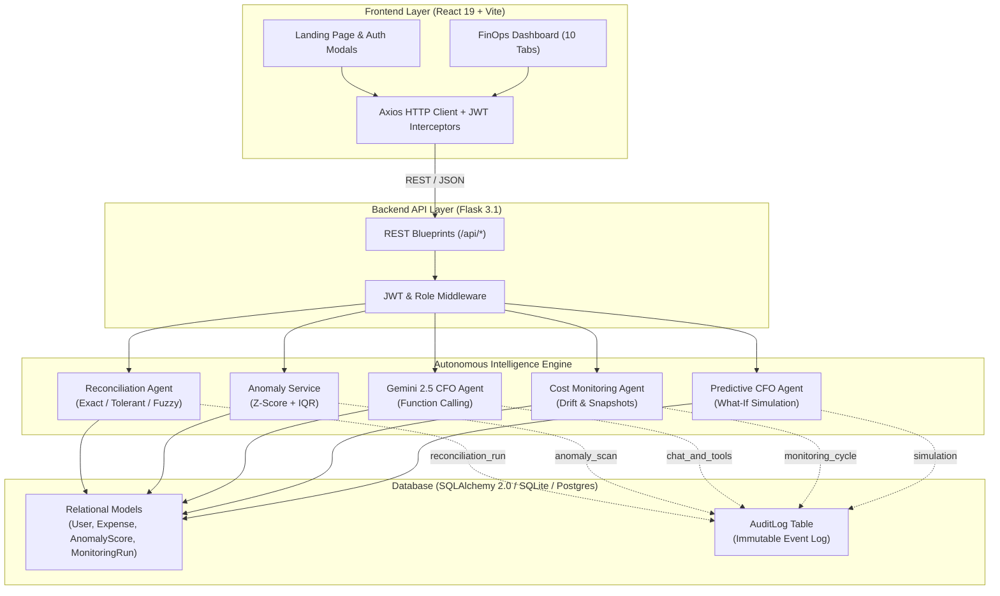

# CostIntel — Autonomous Cost Governance & AI FinOps Controller

[](https://www.python.org/downloads/)
[](https://react.dev/)
[](https://flask.palletsprojects.com/)
[](https://opensource.org/licenses/MIT)

**CostIntel** is an autonomous AI financial controller and FinOps platform that unifies multi-source ledger-to-bank reconciliation, statistical anomaly detection, predictive scenario simulation, and a Gemini-powered CFO reasoning agent backed by an immutable database audit trail.

---

## Key Features

- **3-Tier Multi-Source Reconciliation:**
  - **Tier 1 (Exact):** 1:1 match on amount, date, and vendor name.
  - **Tier 2 (Tolerant):** Configurable tolerance margins (±₹5 amount flex, ±3 days settlement lag).
  - **Tier 3 (Fuzzy AI):** `difflib.SequenceMatcher` vendor string similarity (≥ 0.75) for automatic alias resolution (e.g. `AWS Cloud` ↔ `Amazon Web Services`).
  - **Exception Queue:** Diagnostic triage table tagging unresolvable discrepancies with root causes (`amount_delta`, `date_lag`, `orphaned_statement`).
  - **Audit-Ready PDF:** One-click export of reconciliation summary reports.

- **Statistical Anomaly Detection (Z-Score + IQR):**
  - Pure-Python implementation with dynamic per-category baselines.
  - Computes confidence scores (0–100%) and plain-language mathematical rationales (e.g., *"₹50,000 is 900% higher than average Cloud spend of ₹5,000 (z-score: 3.86)"*).

- **Gemini 2.5 CFO Agent:**
  - Multi-turn autonomous tool calling (`get_expense_summary`, `get_category_totals`, `get_monitoring_recommendations`, `run_simulation`, `get_top_vendors`).
  - Zero-downtime fallback to rule-based execution with 100% database audit trail persistence.

- **Continuous Cost Monitoring & Drift Tracking:**
  - Point-in-time snapshots of scanned records, detected anomalies, and projected savings.
  - Longitudinal spend trend tracking and proactive leak recommendations.

- **Enterprise RBAC & Audit Logging:**
  - Role-based access control (`Viewer`, `Analyst`, `Admin`) with scoped data visibility and soft-deletion recovery.
  - Cross-cutting `AuditLog` table recording every administrative, CRUD, and AI agent execution.

---

## Architecture



---

## Quick Start

### 1. Prerequisites
- **Python 3.11+**
- **Node.js 18+** & npm

### 2. Backend Setup
```bash
cd backend

# Create virtual environment
python -m venv venv

# Activate virtual environment
# Windows:
.\venv\Scripts\activate
# Linux/macOS:
source venv/bin/activate

# Install dependencies
pip install -r requirements.txt

# Configure environment (optional: add Gemini API key)
# Create backend/.env:
# GEMINI_API_KEY=your_gemini_api_key
# JWT_SECRET_KEY=your_jwt_secret

# Start Flask server
python app.py
```
Backend runs on `http://localhost:5000`. Database is automatically initialized with default demo credentials.

### 3. Frontend Setup
```bash
cd frontend

# Install dependencies
npm install

# Start development server
npm run dev
```
Frontend runs on `http://localhost:5173`.

---

## Demo Accounts

| Role | Email | Password | Scope |
| :--- | :--- | :--- | :--- |
| **Admin** | `admin@costintel.com` | `Admin@123` | Full system access, user management, audit logs |
| **Analyst** | `analyst@costintel.com` | `Analyst@123` | Create/manage expenses, trigger reconciliation & anomaly scans |
| **Viewer** | `viewer@costintel.com` | `Viewer@123` | Read-only access to dashboards, reports, and CFO chat |

---

## API Reference

### Authentication & Users
- `POST /api/register` — Create new user account (defaults to Viewer)
- `POST /api/login` — Authenticate and receive JWT access token
- `POST /api/auth/google` — Google OAuth authentication
- `GET /api/profile` — Fetch authenticated user profile
- `GET /api/users` — List platform users *(Admin only)*

### Reconciliation & Anomalies
- `POST /api/reconciliation/run` — Execute 3-tier reconciliation engine
- `GET /api/reconciliation/last-run` — Get latest reconciliation batch results
- `GET /api/reconciliation/batches` — List historical reconciliation runs
- `GET /api/reconciliation/export/pdf` — Download reconciliation PDF report
- `GET /api/anomalies` — List flagged anomalies with confidence metrics
- `POST /api/anomalies/score` — Trigger statistical anomaly re-scoring
- `POST /api/anomalies/<id>/resolve` — Resolve or dismiss an anomaly flag

### CFO Agent & Intelligence
- `POST /api/chat` — Autonomous Gemini 2.5 CFO agent chat with tool execution
- `GET /api/monitoring/status` — Live cost monitoring status
- `POST /api/monitoring/run` — Run manual monitoring cycle
- `GET /api/monitoring/history` — Historical drift summary
- `GET /api/monitoring/runs` — Detailed snapshot list of monitoring cycles
- `POST /api/simulate` — Run what-if spend reduction scenario modeling
- `GET /api/audit/logs` — Query immutable audit trail logs

### Expenses & Analytics
- `GET /api/expenses` — Query and filter ledger entries
- `POST /api/expenses` — Create expense entry
- `POST /api/expenses/upload` — Bulk CSV ingestion with dirty row validation
- `DELETE /api/expenses/<id>` — Soft-delete expense
- `GET /api/dashboard` — Platform KPIs, category breakdown, spend trends

---

## Running Automated Tests

```bash
# Run backend test suite
pytest backend/tests/ -v
```

---

## Tech Stack

| Layer | Technologies | Purpose |
| :--- | :--- | :--- |
| **Backend** | Python 3.11, Flask 3.1, Flask-SQLAlchemy, Flask-JWT-Extended, Flask-Bcrypt | Core REST API, authentication, RBAC |
| **AI & Logic** | `google-genai` (Gemini 2.5 Flash), `difflib`, `ReportLab` | Autonomous CFO agent, fuzzy matching, PDF reports |
| **Frontend** | React 19, Vite, Vanilla CSS, GSAP, Lenis, Lucide Icons, Axios | Responsive SPA, smooth scrolling, interactive FinOps tools |
| **Database** | SQLite (development) / PostgreSQL (production via SQLAlchemy 2.0) | Relational persistence & immutable audit logging |

---

## License

This project is licensed under the [MIT License](LICENSE).
